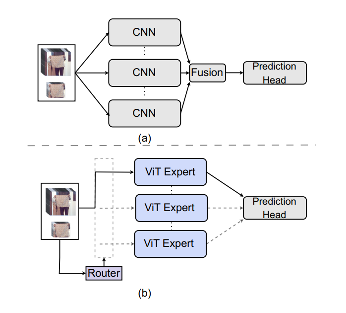
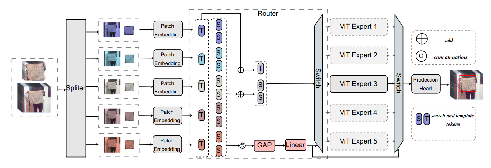
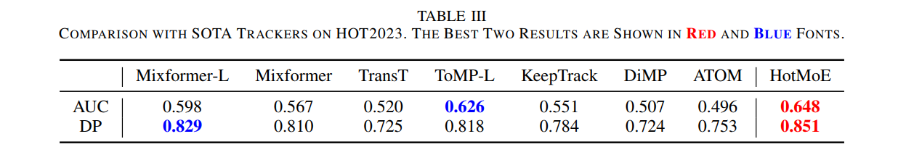
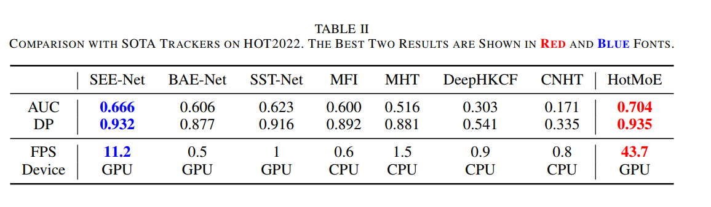

# HotMoE: Exploring Sparse Mixture-of-Experts for Hyperspectral Object Tracking(TMM 2024)
Official implementation of [HotMoE](https://ieeexplore.ieee.org/document/10855488), including models and training&testing codes.


You can download our raw results for HOT2022 and HOT2023 [here](https://drive.google.com/drive/folders/1coxIFkzUhJeJphKAyCnpN5qJ2xQwoL0v?usp=drive_link).


<center></center>


## Introduction
A new unified hyperspectral tracking framework.

- HotMoE has high performance on hyperspectal tracking tasks.

<center></center>


## Results
### On HOT2022 tracking benchmarks
<center></center>


### On HOT2023 tracking benchmark
<center></center>

## Usage
### Installation
Create and activate a conda environment:
```
conda create -n hotmoe python=3.7
conda activate hotmoe
```
Install the required packages:
```
bash install_hotmoe.sh
```

### Data Preparation
Put the training datasets in ./data/. It should look like:
```
$<PATH_of_HotMoE>
-- data
    -- Test
        |-- VIS
        ...
    -- Train
        |-- VIS
        ...

```

### Path Setting
Run the following command to set paths:
```
cd <PATH_of_HotMoE>
python tracking/create_default_local_file.py --workspace_dir . --data_dir ./data --save_dir ./output
```
You can also modify paths by these two files:
```
./lib/train/admin/local.py  # paths for training
./lib/test/evaluation/local.py  # paths for testing
```

### Training
Download the pretrained [foundation model](https://drive.google.com/drive/folders/1ttafo0O5S9DXK2PX0YqPvPrQ-HWJjhSy) (OSTrack) 
and put it under ./pretrained_networks/.
```
python run_training.py
```
You can train models with various modalities and variants by modifying ```run_train.py```.

### Testing
[HOT2022/HOT2023](https://www.hsitracking.com/)
```
python test.py
```
You can test models with various modalities and variants by modifying ```test.py```.

## Acknowledgment
- This repo is based on [OSTrack](https://github.com/botaoye/OSTrack) which is an excellent work.
- We thank for the [PyTracking](https://github.com/visionml/pytracking) library, which helps us to quickly implement our ideas.


